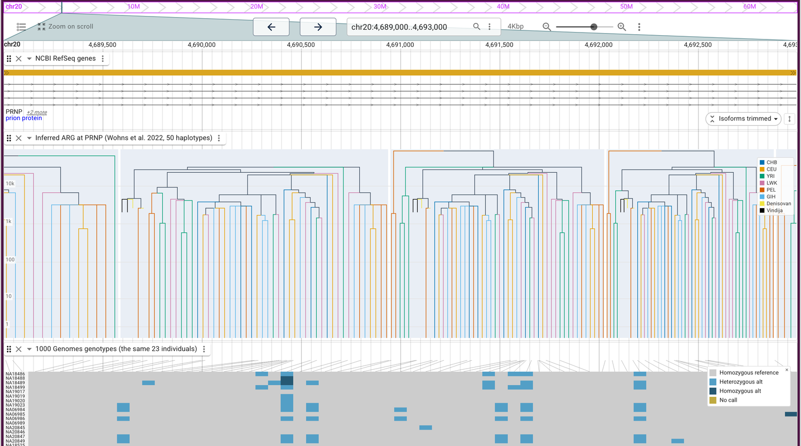
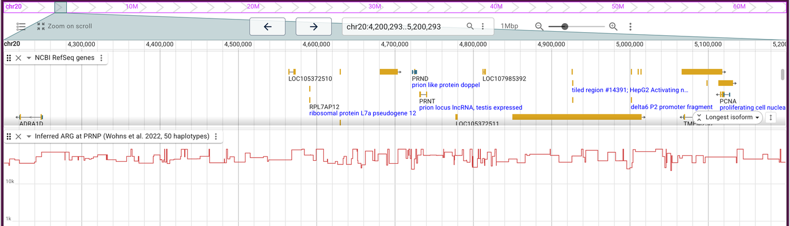

# jbrowse-plugin-arg

Ancestral recombination graphs in JBrowse 2. Reads a [tskit](https://tskit.dev)
tree sequence (`.trees`) and draws its local trees along the genome: **x is
genomic position, y is node time**.



Inspired by [lorax](https://github.com/pratikkatte/lorax), which embeds JBrowse
beside its own ARG viewer. This inverts that — the ARG is a JBrowse display, so
it pans and zooms with the rest of the browser and sits in a track stack next to
genes, variants and coverage.

There is no server. The `.trees` format is a flat key-value store of columnar
arrays ([kastore](https://github.com/tskit-dev/kastore)), and this plugin parses
it in the browser, so a file behind any static URL works.

## Live demo

Nothing to install. An inferred human genealogy at *PRNP* on hg38 chr20 — 23
1000 Genomes individuals across six populations plus a Vindija Neanderthal and a
Denisovan, 50 haplotypes — cut out of the [unified genealogy of modern and
ancient genomes](https://zenodo.org/records/5512994) (Wohns et al. 2022,
`tsinfer` + `tsdate`, GRCh38). Branches are colored by the population every leaf
under them belongs to, and the track below is the 1000 Genomes genotype matrix
for **the same individuals**, so an allele pattern and the clade that carries it
are stacked on one screen.

| view                       | what it shows                                          | open                         |
| -------------------------- | ------------------------------------------------------- | ---------------------------- |
| chr20:4,689,000..4,693,000 | local trees at PRNP, over the matching genotype matrix | [launch][arg-demo-prnp]      |
| chr20:4,200,000..5,200,000 | the surrounding 1 Mb as a TMRCA skyline                | [launch][arg-demo-prnp-wide] |

[arg-demo-prnp]:
  https://jbrowse.org/code/jb2/main/?config=https%3A%2F%2Fjbrowse.org%2Fdemos%2Farg%2Fconfig.json&assembly=hg38&loc=chr20%3A4%2C689%2C000-4%2C693%2C000&tracks=genes%2Cprnp_arg%2Cprnp_variants
[arg-demo-prnp-wide]:
  https://jbrowse.org/code/jb2/main/?config=https%3A%2F%2Fjbrowse.org%2Fdemos%2Farg%2Fconfig.json&assembly=hg38&loc=chr20%3A4%2C200%2C000-5%2C200%2C000&tracks=genes%2Cprnp_arg%2Cprnp_variants

There is a simulated dataset too — an msprime coalescent with no inference
between it and the truth, which is the one thing the real data cannot offer.
It has its own page: [docs/simulated.md](docs/simulated.md).

**The links point at `jb2/main`, not `jb2/latest`, and they have to.** This
plugin composes the v5 display ABI — `MultiRegionDisplayMixin` and
`installUpload` from `@jbrowse/display-kit` and `@jbrowse/render-core` — which
4.3.0, the current stable and what `latest` serves, does not have. On `latest`
the config loads, the other tracks draw, and the ARG track alone shows an error
bar. Point your own deployment at a 5.0.0-beta build.

## What it draws

The picture changes with zoom, without a mode switch. A tree draws its topology
once it has `pxPerLeaf` pixels per sample (2 by default) and collapses to its
TMRCA below that, so dendrograms grow out of the skyline as you zoom in rather
than replacing it.

**Zoomed in** (the picture at the top) — each local tree as a dendrogram, spread
across the interval it spans. Recombination breaks the sequence into trees;
neighbouring ones differ by the subtree a recombination moved.

**Zoomed out** — no tree is wide enough any more, and what is left is the
skyline. It is the same drawing, not a second view: the red follows exactly the
tops of the dendrograms above. Here it runs across the prion gene cluster.



## Config

```json
{
  "type": "ArgTrack",
  "trackId": "my_arg",
  "name": "Ancestral recombination graph",
  "assemblyNames": ["hg38"],
  "adapter": {
    "type": "ArgAdapter",
    "treesLocation": { "uri": "my.trees", "locationType": "UriLocation" },
    "refName": "chr1"
  }
}
```

`refName` is the assembly sequence the tree sequence's coordinates belong to. A
tree sequence covers one sequence; without this the same ARG would draw on every
chromosome of the assembly.

Display slots: `colorBy` (`population` or `none`), `branchColor`,
`skylineColor`, `gridlineColor`, `separateTrees`, `treeCellColor`, `timeScale`
(`log` or `linear`), `pxPerLeaf`, `maxEdges`, `maxSkylinePoints`, `height`.

## One leaf order for the whole sequence

Neighbouring local trees differ only by the subtree a recombination moved, but
if each lays its leaves out in its own traversal order they look unrelated and
the row reads as noise. So a reference tree fixes a rank per sample once per
file, and every tree then orders each node's children by the mean rank of the
leaves beneath them. Clades stay contiguous — that is what makes a dendrogram
readable, and rotation preserves it where sorting leaves into the global order
outright would not — while the order comes as close to the global one as the
topology allows.

Measured over the first 400 trees, the rank correlation between adjacent trees'
leaf orders goes from 0.65 to 0.87 on the simulation and 0.63 to 0.78 on the
real data. The practical effect is that a sample keeps roughly the same column
across a view, so a recombination shows up as one clade jumping rather than
everything reshuffling.

That similarity then makes the boundary between trees matter, which is what
`separateTrees` is for: each tree drawn as a dendrogram gets a faint cell with a
two-pixel gutter, so neighbours are separated by whitespace instead of sharing
an edge.

## Hovering

Hovering a branch reports the node, its time in the file's own units, how many
sample leaves sit below it, the population its clade shares where it has one,
and the local tree's interval. A tree too narrow for a dendrogram was drawn as
its TMRCA and hits as that, which is also what a skyline reports.

The population legend appears only when something on screen is actually drawn
as a tree. Every tree narrower than its leaves need is painted as one TMRCA
segment in a single color, so at that zoom a legend would be advertising an
encoding that is not on screen.

## Coloring by population

`colorBy: population` colors a branch by the population **every** leaf below it
belongs to, and leaves the branches above a join in `branchColor`. So a colored
subtree is a claim — these haplotypes coalesce before they meet anyone else —
and the black above it is where that stops being true. The population comes from
the tree sequence's own population table metadata, so a file with no such
metadata simply draws one color.

The palette is Okabe-Ito, keyed on the populations that actually have samples
rather than on population id: the unified genealogy declares 215 populations and
a 50-haplotype cut carries eight, and keying on the id would hand two of those
eight the same hue for no reason.

## How detail is decided

The display fetches the buffered viewport, so the number of trees in one fetch
already scales with zoom. The worker packs every edge of every tree in that
region unless doing so would exceed `maxEdges` (300k), in which case it sends a
TMRCA skyline binned to `maxSkylinePoints`. Zoom never enters the fetch inputs,
so panning and zooming inside a fetched region repaints without refetching.

Node x positions come back normalized to 0..1 *within each tree's own genomic
interval*, so the renderer needs only that interval's pixel span to place them.
Node times are absolute, and the vertical axis is scaled to the oldest node in
the whole file rather than to what is on screen — the axis does not move as you
pan.

## Development

```bash
pnpm install
pnpm test          # tskit parsing and packing, checked against tskit's own output
pnpm run build     # esm/ and a UMD bundle for the plugin loader
```

`test_data/` holds a 20-sample, 100kb msprime simulation (1144 local trees), a
matching 100kb assembly, and a `config.json` that wires them together — the
offline fixture, unrelated to the deployed demos. To see it:

```bash
pnpm run build
# serve the plugin bundle, the config and the data from one origin, then
npx @jbrowse/capture --instance http://localhost:8899 \
  --config http://localhost:8899/config.json \
  --assembly sim --loc chr1:1-600 --track sim_arg -o arg.png
```

### Publishing the demo

`pnpm betabuild` gates on typecheck, tests and build, uploads the bundle to
`demos/arg/<hash>/` (immutable) and `demos/arg/` (60-second cache), invalidates
CloudFront, and then reads back what the CDN actually serves and compares
digests — the failure it exists to catch is a demo config naming a URL that
404s or serves yesterday's bundle. The demo config itself lives in the
jbrowse-components repo at `demos/arg/config.json` and deploys with
`scripts/deploy-demo.sh arg/config.json`; `scripts/simulate_chr20_demo.py` here
regenerates the tree sequence behind it.

## Correctness

The `.trees` reader is checked against tskit itself, not against its own output.
`test/treeSequence.test.ts` pins table shapes, the tree count, and — at five
positions across the sequence — the tree index, interval, root and parent array
that `ts.at(pos)` gives in Python, plus a full 1144-tree walk and the region
packer's edge counts and TMRCA values.

Seeking is what makes this usable on a large file: tskit stores edge insertion
and removal orders, sorted by left and by right coordinate, so two binary
searches bound the edges active at a position and the tree is built directly
rather than by replaying every breakpoint before it.

## Limits

- **The whole file is downloaded.** `.trees` has no genomic index — the format
  is one flat store of columns — so there is nothing to range-request against.
  Fine for simulations and chromosome-scale files; not for biobank-scale ones,
  which is the problem lorax's backend exists to solve.
- **`.trees.tsz` (tszip) is not supported.** Detected and reported, not
  decompressed. Run `tsunzip` first.
- **Mutations are not drawn.** The site and mutation tables are parsed and
  available; nothing plots them. This is the gap that would most improve the
  demo above — a mutation drawn on the branch that carries it is the explicit
  link between a clade in the tree and a column in the genotype matrix.
- **Canvas2D only.** Well inside the threshold where a GPU path would earn its
  keep (~100K features/frame); the edge budget keeps a frame under that.
