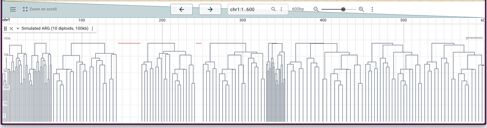
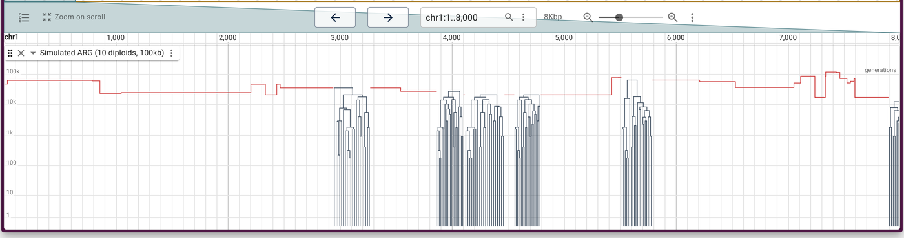
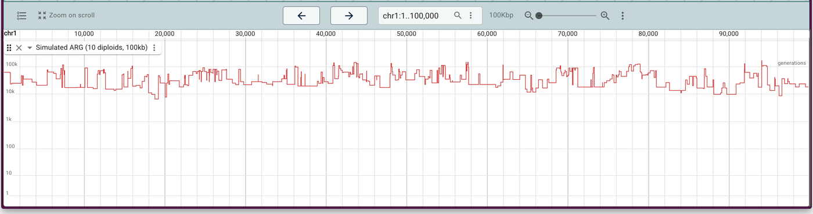

# jbrowse-plugin-arg

Ancestral recombination graphs in JBrowse 2. Reads a [tskit](https://tskit.dev)
tree sequence (`.trees`) and draws its local trees along the genome: **x is
genomic position, y is node time**.



Inspired by [lorax](https://github.com/pratikkatte/lorax), which embeds JBrowse
beside its own ARG viewer. This inverts that — the ARG is a JBrowse display, so
it pans and zooms with the rest of the browser and sits in a track stack next to
genes, variants and coverage.

There is no server. The `.trees` format is a flat key-value store of columnar
arrays ([kastore](https://github.com/tskit-dev/kastore)), and this plugin parses
it in the browser, so a file behind any static URL works.

## What it draws

The picture changes with zoom, without a mode switch. A tree draws its topology
once it has `pxPerLeaf` pixels per sample (2 by default) and collapses to its
TMRCA below that, so dendrograms grow out of the skyline as you zoom in rather
than replacing it.

**Zoomed in** (the picture above) — each local tree as a dendrogram, spread
across the interval it spans. Recombination breaks the sequence into trees;
neighbouring ones differ by the subtree a recombination moved. The two red
segments there are trees too narrow to show topology.

**Mid zoom** — the mixture. The skyline is continuous; the wide trees, the ones
no recombination has broken up for a few hundred bases, are drawn in full.



**Whole sequence** — a TMRCA skyline. Where it dips, the sample's lineages find
a common ancestor recently; where it spikes, deep structure survives at that
locus.



## Config

```json
{
  "type": "ArgTrack",
  "trackId": "my_arg",
  "name": "Ancestral recombination graph",
  "assemblyNames": ["sim"],
  "adapter": {
    "type": "ArgAdapter",
    "treesLocation": { "uri": "my.trees", "locationType": "UriLocation" },
    "refName": "chr1"
  }
}
```

`refName` is the assembly sequence the tree sequence's coordinates belong to. A
tree sequence covers one sequence; without this the same ARG would draw on every
chromosome of the assembly.

Display slots: `branchColor`, `skylineColor`, `gridlineColor`, `timeScale`
(`log` or `linear`), `pxPerLeaf`, `maxEdges`, `maxSkylinePoints`, `height`.

## How detail is decided

The display fetches the buffered viewport, so the number of trees in one fetch
already scales with zoom. The worker packs every edge of every tree in that
region unless doing so would exceed `maxEdges` (300k), in which case it sends a
TMRCA skyline binned to `maxSkylinePoints`. Zoom never enters the fetch inputs,
so panning and zooming inside a fetched region repaints without refetching.

Node x positions come back normalized to 0..1 *within each tree's own genomic
interval*, so the renderer needs only that interval's pixel span to place them.
Node times are absolute, and the vertical axis is scaled to the oldest node in
the whole file rather than to what is on screen — the axis does not move as you
pan.

## Development

```bash
pnpm install
pnpm test          # tskit parsing and packing, checked against tskit's own output
pnpm run build     # esm/ and a UMD bundle for the plugin loader
```

`test_data/` holds a 20-sample, 100kb msprime simulation (1144 local trees), a
matching 100kb assembly, and a `config.json` that wires them together. To see it:

```bash
pnpm run build
# serve the plugin bundle, the config and the data from one origin, then
npx @jbrowse/capture --instance http://localhost:8899 \
  --config http://localhost:8899/config.json \
  --assembly sim --loc chr1:1-600 --track sim_arg -o arg.png
```

## Correctness

The `.trees` reader is checked against tskit itself, not against its own output.
`test/treeSequence.test.ts` pins table shapes, the tree count, and — at five
positions across the sequence — the tree index, interval, root and parent array
that `ts.at(pos)` gives in Python, plus a full 1144-tree walk and the region
packer's edge counts and TMRCA values.

Seeking is what makes this usable on a large file: tskit stores edge insertion
and removal orders, sorted by left and by right coordinate, so two binary
searches bound the edges active at a position and the tree is built directly
rather than by replaying every breakpoint before it.

## Limits

- **The whole file is downloaded.** `.trees` has no genomic index — the format
  is one flat store of columns — so there is nothing to range-request against.
  Fine for simulations and chromosome-scale files; not for biobank-scale ones,
  which is the problem lorax's backend exists to solve.
- **`.trees.tsz` (tszip) is not supported.** Detected and reported, not
  decompressed. Run `tsunzip` first.
- **No hit-testing yet** — no click or hover on a node or branch.
- **Mutations are not drawn.** The site and mutation tables are parsed and
  available; nothing plots them.
- **Canvas2D only.** Well inside the threshold where a GPU path would earn its
  keep (~100K features/frame); the edge budget keeps a frame under that.
