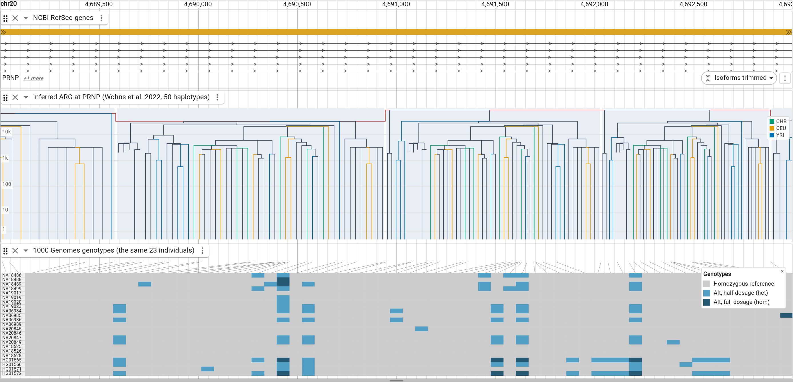
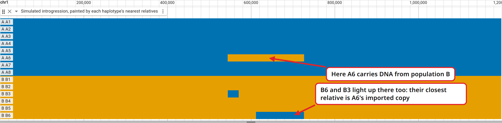

# jbrowse-plugin-arg

Ancestral recombination graphs in JBrowse 2. Reads a [tskit](https://tskit.dev)
tree sequence (`.trees`) and draws its local trees along the genome: x is
genomic position, y is node time. No server: the plugin parses the file in the
browser, so any static URL works.

## **[Live demo: an inferred human ARG at PRNP →][arg-demo-prnp]**






[arg-demo-prnp]:
  https://jbrowse.org/code/jb2/main/?config=https%3A%2F%2Fjbrowse.org%2Fdemos%2Farg%2Fconfig.json&assembly=hg38&loc=chr20%3A4%2C689%2C000-4%2C693%2C000&tracks=genes%2Cprnp_arg%2Cprnp_variants

The demo links point at `jb2/main`, not `jb2/latest`: the plugin needs the v5
display ABI, which 4.3.0 lacks.

## Config

```json
{
  "type": "ArgTrack",
  "trackId": "my_arg",
  "name": "Ancestral recombination graph",
  "assemblyNames": ["hg38"],
  "adapter": {
    "type": "ArgAdapter",
    "treesLocation": { "uri": "my.trees", "locationType": "UriLocation" },
    "refName": "chr1"
  }
}
```

`refName` is the assembly sequence the tree sequence belongs to.

## Docs

- [Display reference](docs/display.md): draw modes, settings, hover, mutations,
  population colors, level of detail
- [Selective sweep](docs/sweep.md) and
  [introgression painting](docs/introgression.md): worked examples with live
  links
- [Simulated demo](docs/simulated.md)
- [Development](docs/development.md): building, figures, publishing, limits

Inspired by [lorax](https://github.com/pratikkatte/lorax).
