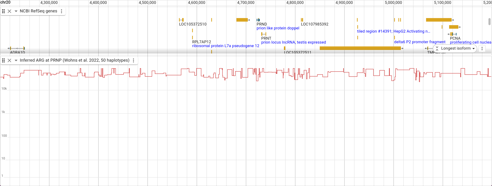
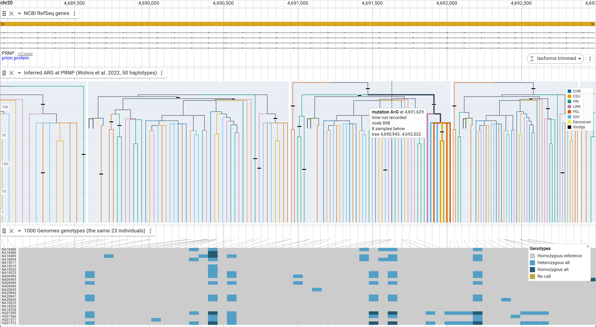

# Display reference

## What it draws

The `draw` setting picks what every tree in the view looks like, and the track
menu's **Draw** submenu switches it:

- `both` (default) — the TMRCA line runs under every tree across the whole view,
  and dendrograms sit on it where they fit.
- `trees` — dendrograms only. A tree too narrow for one still falls back to its
  TMRCA segment, since there is nothing else to draw.
- `tmrca` — the line alone, at every zoom.

A tree draws its topology once it has `pxPerLeaf` pixels per sample (2 by
default). Trees narrower than that are grouped into columns of that width. A
column holding up to four trees draws the one that spans the most sequence. A
busier column collapses to its TMRCA.

A column's tree is a stand-in, and the display says so. A strip along the foot
of its cell darkens the interval that tree really spans, in `sampleSpanColor`,
and hovering it reports how many trees it stands for.

**Zoomed in** (the picture at the top) — each local tree as a dendrogram, spread
across the interval it spans. Recombination breaks the sequence into trees;
neighbouring ones differ by the subtree a recombination moved.

**Zoomed out** — no tree is wide enough any more, and what is left is the
skyline. It is the same drawing, not a second view: the red follows exactly the
tops of the dendrograms above. Here it runs across the prion gene cluster.



## Config

```json
{
  "type": "ArgTrack",
  "trackId": "my_arg",
  "name": "Ancestral recombination graph",
  "assemblyNames": ["hg38"],
  "adapter": {
    "type": "ArgAdapter",
    "treesLocation": { "uri": "my.trees", "locationType": "UriLocation" },
    "refName": "chr1"
  }
}
```

`refName` is the assembly sequence the tree sequence's coordinates belong to. A
tree sequence covers one sequence; without this the same ARG would draw on every
chromosome of the assembly.

Display slots: `draw` (`both`, `trees` or `tmrca`), `colorBy` (`population` or
`none`), `branchColor`, `skylineColor`, `gridlineColor`, `separateTrees`,
`treeCellColor`, `timeScale` (`log` or `linear`), `pxPerLeaf`, `maxEdges`,
`maxSkylinePoints`, `height`, `sampleSpanColor`, `showMutations`,
`mutationColor`, `highlightSamples` and `highlightColor`.

`highlightSamples` takes sample node ids as strings. In every tree it draws each
of those samples' own branch in `highlightColor`, and draws the branches that
sample first joins bold in their population colors. That shows who a haplotype's
nearest relatives are as that changes along the genome.

None of these needs a config edit to try. Clicking a branch traces it the same
way, and clicking it again stops. The track menu toggles the log time scale,
population coloring, mutation ticks and tree cells, and clears every traced
lineage at once.

## One leaf order for the whole sequence

Neighbouring local trees differ only by the subtree a recombination moved, but
if each lays its leaves out in its own traversal order they look unrelated and
the row reads as noise. So a reference tree fixes a rank per sample once per
file, and every tree then orders each node's children by the mean rank of the
leaves beneath them. Clades stay contiguous — that is what makes a dendrogram
readable, and rotation preserves it where sorting leaves into the global order
outright would not — while the order comes as close to the global one as the
topology allows.

That similarity then makes the boundary between trees matter, which is what
`separateTrees` is for: each tree drawn as a dendrogram gets a faint cell with a
two-pixel gutter, so neighbours are separated by whitespace instead of sharing
an edge.

## Hovering

Hovering a branch draws its whole clade bold and reports the node, its time in
the file's own units, how many sample leaves sit below it, the population its
clade shares where it has one, and the local tree's interval. A tree too narrow
for a dendrogram was drawn as its TMRCA and hits as that, which is also what a
skyline reports.

## Mutations

Each mutation is a tick on the branch that carries it. The tick sits at the time
the mutation happened, or halfway up the branch where the file does not record
one; tsinfer and tsdate output, like the PRNP demo, does not. Hovering a tick
names the allele change and its site, bolds the clade of samples that inherit
it, and drops a dashed guide to the site's genomic position.



In the demo the guide lands where the genotype matrix's connector line for that
site starts, so the clade in the tree and the carriers in the matrix are the
same haplotypes. `showMutations` turns the ticks off, and `mutationColor` sets
their color.

## Coloring by population

`colorBy: population` colors a branch by the population **every** leaf below it
belongs to, and leaves the branches above a join in `branchColor`. So a colored
subtree is a claim — these haplotypes coalesce before they meet anyone else —
and the black above it is where that stops being true. The population comes from
the tree sequence's own population table metadata, so a file with no such
metadata simply draws one color.

## How detail is decided

The display fetches the buffered viewport, so the number of trees in one fetch
already scales with zoom. The worker packs every edge of every tree in that
region unless doing so would exceed `maxEdges` (300k), in which case it sends a
TMRCA skyline binned to `maxSkylinePoints`. Zoom never enters the fetch inputs,
so panning and zooming inside a fetched region repaints without refetching.

Node x positions come back normalized to 0..1 _within each tree's own genomic
interval_, so the renderer needs only that interval's pixel span to place them.
Node times are absolute, and the vertical axis is scaled to the oldest node in
the whole file rather than to what is on screen — the axis does not move as you
pan.
