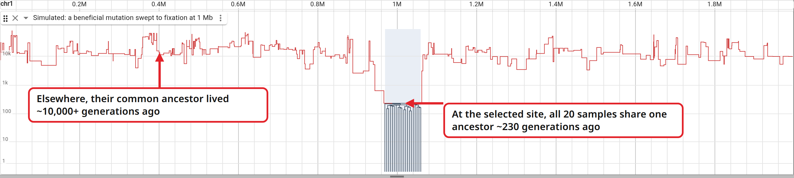

# Selective sweep example



This is 2 Mb of simulated genome from 20 haplotypes. A beneficial mutation arose
at 1 Mb and swept to fixation. The red line is how long ago all 20 samples last
shared an ancestor, measured at each position along the genome.

Across most of the sequence that ancestor lived 10,000 or more generations ago.
At the swept site the line falls off a cliff. The selected mutation copied one
haplotype into everyone within a few hundred generations, so all 20 samples
descend from one ancestor about 230 generations back. Zoomed out this far, that
stretch is the only place a local tree is wide enough to draw, and it is a squat
comb. Sequence farther from the selected site had more chances to recombine away
from the sweeping haplotype, so the dip narrows back to the background within
about 100 kb.

[Open this view in JBrowse][sim-sweep].

[sim-sweep]:
  https://jbrowse.org/code/jb2/main/?config=https%3A%2F%2Fjbrowse.org%2Fdemos%2Farg%2Fconfig.json&assembly=sim&loc=chr1%3A1-2%2C000%2C000&tracks=sim_sweep

The figure is fully reproducible. msprime is pinned and so is the random seed,
and the script renders against `jb2/main`:

```bash
uv run --with msprime==1.4.4 python scripts/figures/simulate_sweep.py
pnpm build
node scripts/figures/figures.mjs sweep   # writes img/sweep.png
```
